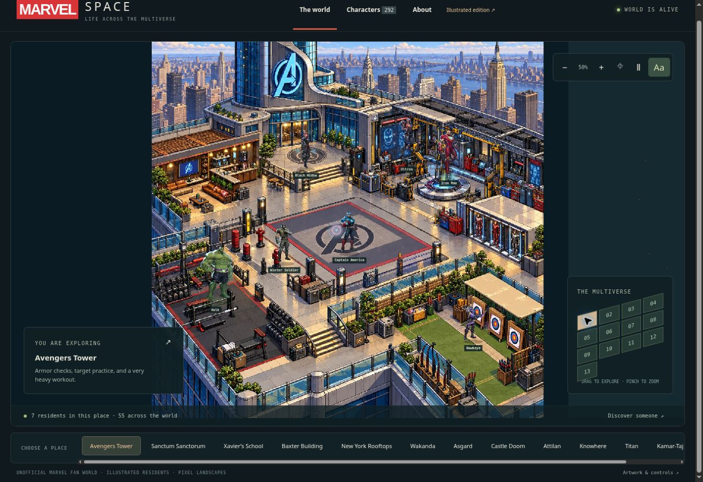

# Verified production deployment · 2026-10-09

- Live URL: https://marvel-space-pi.vercel.app/
- Vercel project: `marvel-space` (`prj_MPE6LqdYYy3EjCcwlXi8aKu69AP5`)
- Deployment: `dpl_8MTPTPg6Nn7ye2QVNvbhzovrUZTU`
- Source commit: `d827d78c3faefe3283766d34daddf7881145dc76`
- Environment/status: production / READY
- Framework: static (Other), Node.js 24, repository root, `npm run build`, output `dist`.
- Build duration reported by Vercel: approximately 9.5 seconds.

## Evidence

A fresh shallow clone of the published commit passes `npm run check`, all 20 tests, and `npm run build`. All 141 required runtime files exist in the clone, independent of the original local checkpoint.

The public production URL was opened without a sign-in wall. Avengers Tower renders its background and residents. The directory exposes 55 illustrated residents and a 292-record archive. Searching Spider-Man and selecting him focuses New York Rooftops and opens his Peter Parker inspector. Switching to Wakanda and back updates the selected scene and resident count.

Browser console inspection found only cloud-browser extension metadata errors, not application errors during these checks. This static site has no server functions; no runtime-log/monitoring claim is made. Physical mobile touch gestures, extended performance testing, and exhaustive browser checks for every interaction remain unverified.

The build-log API returned a team-scope access error, so remote build logs were not inspected. Deployment READY status, public HTTP 200, the live 55-resident manifest, the fresh-clone build, and direct browser checks provide the verification evidence above.

The follow-up documentation commit records this release without changing its runtime files. `CHECKPOINT.md` describes what remains for future artwork work.
