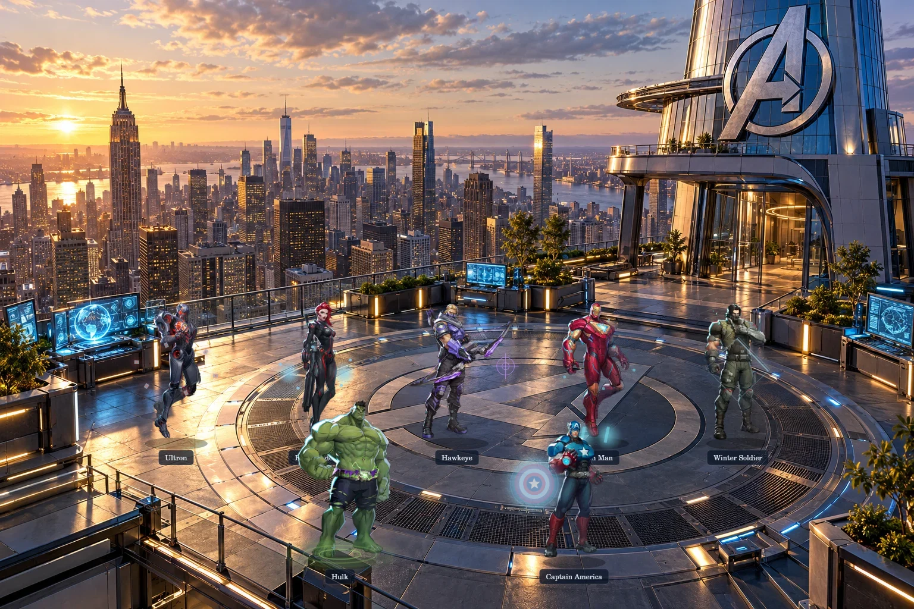

# Marvel Multiverse · Illustrated edition

An independent Marvel fan playground about the life between missions. This revision replaces the block figures and repeated isometric rooms with detailed full-body illustrations and cinematic location paintings.



## What is included

- 292 searchable character/variant entries, including heroes, villains and cosmic characters.
- 55 illustrated residents, each with a transparent 20-frame WebP sprite sheet, an authored everyday moment and character-specific procedural effects.
- 12 distinct settings: Avengers Tower, Sanctum Sanctorum, Wakanda, Asgard, Baxter Building, Castle Doom, Xavier’s School, Knowhere, Hell’s Kitchen, Queens, Titan and Attilan.
- Character details, source attribution, name labels, world selection, random discovery, pan/zoom, touch pinch, pause, reduced-motion support and keyboard shortcuts.
- Local assets. No runtime API, account, paid service or environment variables required.

**Coverage is intentionally visible.** This is a curated expanding archive, not every Marvel character. 55 characters have full-body scene animation; the other entries are portrait records. Doctor Doom, Falcon, the three actor-specific Spider-Man variants and other missing full-body characters remain marked as archive entries. Actor variants do not have actor-specific illustrations yet.

**Animation quality:** the 20-frame sheets contain subtle puppet movement derived from an existing illustration, accompanied by character-specific effects. They are not 20 separately drawn action poses or film-realistic animation. Producing unique multi-pose action sheets for the entire Marvel catalogue remains unfinished art-production work. The manifest and renderer are ready for replacement pose sheets.

**Continuity:** these are imagined crossover locations, not a confirmed list of universes in Avengers: Doomsday. Marvel Rivals artwork depicts game interpretations; it is not labelled as an MCU actor likeness. Earth labels organize the fan setting rather than making a canonical claim about every resident.

## Run locally

Requires Node.js 20+.

```sh
npm run dev
```

Open the URL printed by the server. To build the static site:

```sh
npm run build
```

The output is `dist/`. No dependency installation is required for serving, building or the normal tests.

## Deploy to Vercel

Import this repository. Choose **Other** as the framework, **npm run build** as the build command and **dist** as the output directory. `vercel.json` includes those settings. No environment variables are needed.

## Controls

| Input | Action |
| --- | --- |
| Drag / touch drag | Move through the current scene |
| Wheel / pinch / + / − | Zoom |
| Character / resident chip | Open character details |
| Space | Pause / resume |
| / | Open character search |
| R | Find a random illustrated resident |
| 0 | Fit the current location |
| Escape | Close details / dialog |

## Asset layout and adding real action poses

`public/js/data.js` contains the realms, character records and frame metadata. `public/assets/characters/<id>-loop.webp` is a five-column, four-row transparent sheet with 320 × 400 cells. Each record specifies `frames`, `columns`, `frameWidth`, `frameHeight`, `period`, `phase`, `effect`, and `task`. Replace a sheet with a commissioned or licensed sequence of 20 unique poses, preserve cell dimensions and grounding, and update the credit in `public/assets/provenance/full-body.json`. The renderer crops the correct frame directly from the sheet.

To add a full-body animated character, add its local illustration and sheet, change its status to `animated`, give it a location and scene coordinates, and define its effect and moment. Catalogue characters never silently fall back to a block figure.

The optional preparation/review scripts need `sharp` and `@napi-rs/canvas` (install with `npm install --no-save sharp @napi-rs/canvas`). They are development utilities, not build requirements. `fetch-art.py` retrieves publicly referenced art and records provenance; `prepare-assets.mjs` expects downloaded originals under `.work/originals`. Generation source paths in the location utilities are local development inputs. Published optimized assets are already present.

To produce an optional self-contained HTML file with every image embedded:

```sh
npm run standalone
```

This file is much larger than the normal website. The hosted version loads only the current scene's sheets and loads a shared portrait atlas for the archive.

## Verification

```sh
npm run check
npm test
npm run build
```

Tests check the complete local asset graph, transparent atlas dimensions, frame indexing/wrap, selection bounds, pointer-anchored zoom, cache eviction/retry, stale location-load isolation, every effect's finite balanced drawing commands, and the app's real search/filter/detail/navigation/playback handlers using a DOM contract harness.

`node scripts/render-review.mjs` renders the actual renderer and image assets into review files. The contact sheet is in `docs/location-contact-sheet.webp`.

Browser layout, real touch gestures and device performance have not been verified in this environment. The rendered art review and DOM contract tests are not a substitute for browser QA.

## Art sources and credits

- Most full-body illustrations: official [Marvel Rivals hero pages](https://www.marvelrivals.com/heroes/), © Marvel / NetEase Games. Every imported illustration's original page and image URL is retained in `public/assets/provenance/full-body.json`.
- Thanos full-body render: [PNGAAA source page](https://www.pngaaa.com/detail/2218424). The original artist / character owner retains the artwork rights.
- Portrait catalogue: [akabab/superhero-api](https://github.com/akabab/superhero-api). The data project's MIT notice is retained in `public/assets/provenance/superhero-api-LICENSE.txt`. Marvel identities were curated from the source; source classifications are not treated as authoritative canon.
- Location paintings: generated specifically for this fan project. Original generated files are separate from the optimized shipped backgrounds.

Marvel characters and third-party artwork remain the property of their respective rights holders. Public availability and data-project licensing do not transfer artwork rights. This is an unofficial noncommercial fan project with source attribution; no affiliation with Marvel, Disney or NetEase is claimed. Application code is available under the MIT license; that license excludes third-party artwork and trademarks.
