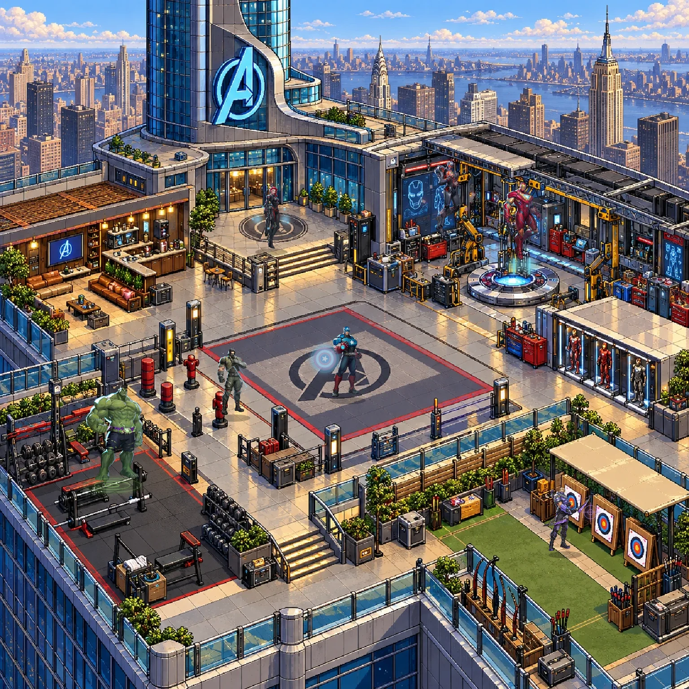

> **Upload checkpoint:** 63 artwork files remain to be transferred. See [PUSH_STATUS.md](PUSH_STATUS.md) for the complete pending list. This checkpoint is not yet a complete runnable deployment.

# Marvel Space · Connected multiverse

Explore 13 detailed pixel-art locations across one continuous canvas. The latest connected-world edition is now the default page. The previous illustrated scene viewer remains available at `/illustrated.html`.



- 13 prepared landscapes: Avengers Tower, Sanctum Sanctorum, Xavier’s School, Baxter Building, New York Rooftops, Wakanda, Asgard, Castle Doom, Attilan, Knowhere, Titan, Kamar-Taj and Madripoor.
- 55 recognizable illustrated residents, with their existing transparent 20-frame puppet sheets and signature effects, placed individually on the inspected landscapes.
- 292 searchable character/variant records, including portraits for entries whose full-body artwork is pending.
- One connected canvas with a sector map, location rail, character inspector, search, random discovery, pan, wheel/pinch zoom, pause, name labels and reduced-motion support.
- Local assets and dependency-free serving, tests and static builds. No runtime accounts, API keys or external asset fetches.

**Art production is still incomplete.** The character sheets contain puppet motion derived from a single illustration. They are not 20 separately drawn action poses. Pixel landscapes and illustrated character artwork are distinct styles. Attilan has no full-body resident yet; Doom and the actor-specific Spider-Man variants remain portrait archive records. This is a curated expanding archive, not every Marvel character. The interface exposes these distinctions.

## Run and deploy

Requires Node.js 20+:

```sh
npm run dev
npm run check
npm test
npm run build
```

`npm run dev` serves `public/`. The static build is `dist/`; Vercel configuration is included. Import the repository with **Other** as the framework, **npm run build** as the build command, and **dist** as the output directory.

The default page opens the connected world. `/world/` opens the same world directly. `/illustrated.html` opens the previous illustrated edition. `npm run standalone` exports that older illustrated edition as a self-contained HTML file.

## Controls

| Input | Action |
| --- | --- |
| Drag / touch drag | Pan through the connected world |
| Wheel / pinch / + / − | Zoom around the pointer |
| Resident / directory card | Open character details |
| Space | Pause / resume |
| / or A | Search characters |
| F | Fit the selected location |
| M | Fit the whole multiverse |
| Arrow keys | Pan |
| Escape | Close details / dialog |

The overview loads backgrounds without decoding all 55 large sprite sheets. Artwork loading is limited to four concurrent requests; the cache discards older offscreen images. Failed requests can retry by reopening a location. A later location selection takes precedence over an earlier pending character focus.

## Artwork and preparation

`public/world/sprites.json` records each actor’s sheet, 20 frame crops, loop sequence, grounding, place, task, effects and source. Sheet paths reuse `public/assets/characters/` without duplicating or altering the source illustrations. Replace them with proper pose sequences as that artwork is produced.

`public/world/assets/provenance.json` records the source output, checksum and exact crop for every background. All four raw generated outputs are retained in `work-in-progress/generated-assets/`. The earlier incomplete pixel-world code is an archived checkpoint; current runnable code is in `public/world/`.

`npm run prepare:world` reproducibly crops the 13 landscapes and rebuilds the manifest from explicit inspected placements. Preparation uses `sharp`; the renderer review uses `sharp` and `@napi-rs/canvas`. Install those development utilities with `npm install --no-save sharp @napi-rs/canvas` if needed. They are not required for a normal build.

`node scripts/render-connected-review.mjs` renders the actual backgrounds, sprite crops and effects into the preview and [13-location contact sheet](docs/connected-contact-sheet.webp).

## Verification and remaining work

The 15 tests cover both editions’ real application handlers, archive filtering and selection, the complete local asset graph, atlas/crop bounds, negative-time and period wrapping, pointer-anchored zoom, pinch selection suppression, retryable image requests, stale focus isolation, landscape-only overview loading and finite balanced drawing commands for every effect.

All 13 connected-world scenes were rendered and visually inspected. Browser layout, physical touch gestures and device performance have not been verified in this environment. These checks do not substitute for browser QA.

Remaining work: distinct character-specific action poses, expanded full-body coverage, consistent pixel character art, richer character/environment interactions, and browser/device QA. Those are not reported as completed by the integration of the existing assets.

## Credits

- Full-body artwork: official [Marvel Rivals hero pages](https://www.marvelrivals.com/heroes/), © Marvel / NetEase Games. Original artwork/page URLs are retained in `public/assets/provenance/full-body.json`.
- Thanos render: [PNGAAA source page](https://www.pngaaa.com/detail/2218424).
- Portrait catalogue: [akabab/superhero-api](https://github.com/akabab/superhero-api), with its data-project MIT notice retained in `public/assets/provenance/`.
- Landscapes: generated fan interpretations, with exact crops recorded in the connected-world provenance file.

This is an imagined fan crossover. Place and Earth labels do not establish a canonical universe list for an upcoming film. Game illustrations are not presented as actor likenesses.

Marvel characters and third-party artwork remain their owners’ property. This unofficial noncommercial fan project is not affiliated with Marvel, Disney or NetEase. Application code uses the MIT license; that license excludes third-party artwork and trademarks.
